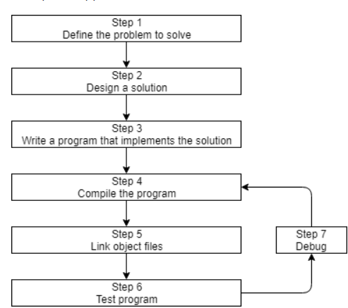

# How are programs developed in C++


## Step 1: Define the problem
This is the “what” step, where you figure out what problem you are intending to solve. Creating a specific goal in mind for what is program will do, eg. thinking in terms of input, the process and the output desired.
Examples: 
- I want to write a program that takes in a number and tells me if it is even or odd.(basic).
- I want to write as program that takes in programs
- I want to write a program that takes list of search results and import them into another program (Example of something I built).

## Step 2: Planning how to solve the problem
The "how" step of the process, this is where you use the knowledge, there are many ways to solve a problem but some solutions are better than others.
A few characteristics of a good solution:
- Simple
- Well documented
- Modular
- Gracefully handles errors

"When you sit down and start coding right away, you’re typically thinking “I want to do <something>”, so you implement the solution that gets you there the fastest. This can lead to programs that are fragile, hard to change or extend later, or have lots of bugs. A bug is any kind of programming error that prevents the program from operating correctly." - LearnCpp.com

Note: Most of the time you will end up going back and re-planning the program anyway after encountering bugs.

### Step 3: Write the program
This is where you start writing the code to solve your problem the code that you write in the editor/IDE is called the source code and this code the that will be compiled to machine code. 
Here is a basic program in C++ that prints out some text to the console (Terminal/Command Prompt/Powershell, Bash, Zsh many more names for the same thing.).:
```cpp
#include <iostream>

int main()
{
    std::cout << "Here is some text.";
    return 0;
}
```
It is highly recommended to write code using a Code Editor like [Visual Studio Code](https://code.visualstudio.com/)

Many realworld programs are made up of many files, and it is common to break up code into multiple files to make it easier to manage.

> **Best Practice:** Name the first/primary source code file in each program main.cpp. This makes it easy to determine which source code file is the primary one.

